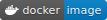

----

This repository contains demo Micro Frontends for 
[Isomorphic Layout Composer (ILC)](https://github.com/namecheap/ilc).
Please check out the [original ILC repository](https://github.com/namecheap/ilc) for more information about it.

## Online demo

http://demo.microfrontends.online/

## List of the demo Micro Frontends
### Applications
1. [System](./apps/system) – written in vanilla JS, with SSR. Port: `8240`
1. [News](./apps/news-ssr) – written in Vue.js, with SSR. Port: `8239`
1. [Navigation](./apps/navbar) – written in React, with SSR. Port: `8235`
1. [People](./apps/people) – written in React, no SSR. Port: `8236`
1. [Planets](./apps/planets) – written in Vue.js, no SSR. Port: `8237`

### Services
1. [fetchWithCache](./apps/fetchWithCache) (used by News & People). Port: `8238`

## Quick start

1. Clone the repo
1. Run `docker run --rm -it -p 8235-8240:8235-8240 namecheap/ilc-demo-apps`
    * Optionally you build your own Docker image with `docker build -t namecheap/ilc-demo-apps:latest .`
1. Open `127.0.0.1` at respective ports to see apps running.

## Development process

1. Clone the repo
1. Run `npm install`
1. Run `npm run build:all`
1. Run `npm run dev`
1. Open `127.0.0.1` at respective ports to see apps running.
